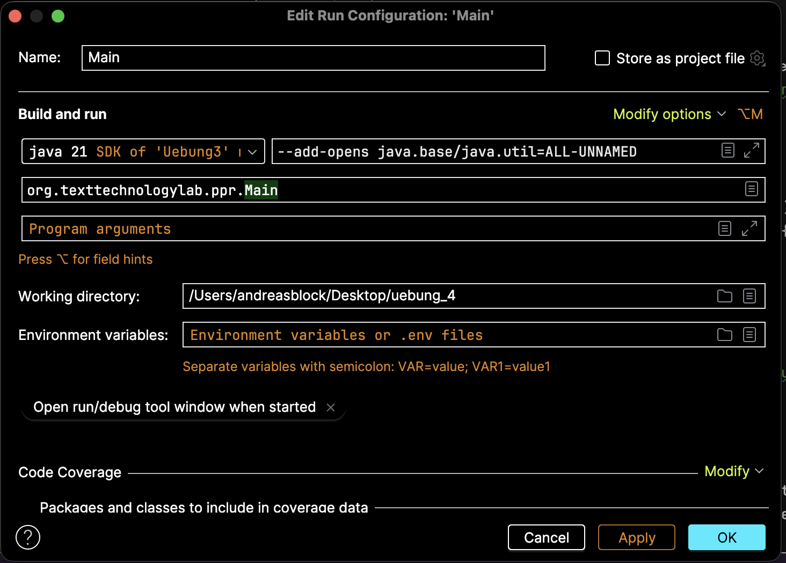

A comprehensive platform for processing, analyzing, and visualizing parliamentary protocols from the German Bundestag with advanced NLP capabilities and multimedia processing.

---


## Overview

The Parliamentary Protocol Analysis System processes XML-formatted parliamentary protocols from the German Bundestag and aligns them with video recordings to create a rich multimedia dataset. The system integrates NLP pipelines and video transcription services to enrich data with sentiment analysis, topic modeling, named entity recognition, and speech-to-text capabilities.

### What It Does

- **Parses** parliamentary protocol XML files from the Bundestag
- **Aligns** text protocols with corresponding video recordings
- **Analyzes** speeches using advanced NLP techniques (sentiment, topics, entities)
- **Transcribes** video content using OpenAI Whisper
- **Stores** all data in MongoDB for flexible querying
- **Serves** data via REST API and interactive web dashboard

---

## Key Features

### Data Management

- **MongoDB-First Architecture** - Uses MongoDB as primary data store
- **Entity Extraction** - Automatically identifies speakers, speeches, sessions, and comments from XML
- **Video-First Processing** - Prioritizes speeches with available video files
- **Smart Duplicate Detection** - Prevents redundant processing of existing sessions
- **CAS Persistence** - Stores UIMA analysis results in XMI format for interoperability

### NLP & Analytics

- **Sentiment Analysis** - Calculates sentiment scores for each speech
- **Topic Modeling** - Classifies speeches into categories with probability scores
- **Named Entity Recognition** - Extracts persons, locations, and organizations
- **POS Tagging** - Part-of-speech analysis for linguistic insights
- **DUUI Integration** - Remote NLP service via Docker Unified UIMA Interface

### Multimedia Processing

- **Whisper Integration** - Automatic speech-to-text transcription via CLI
- **Video Alignment** - Matches speeches to corresponding video files
- **Multi-Format Support** - Handles MP4 video files

### Web Interface

- **Speaker Profiles** - Detailed views including biography and speech history
- **Speech Visualization** - Full text with inline comments and NLP insights
- **Video Streaming** - Integrated video player for speeches
- **Statistics Dashboard** - Visualizations for speech metrics and linguistic features
- **Interactive API** - Swagger UI for API exploration

---

## Technology Stack

### Backend
- **Java 21** - Core application language
- **Javalin** - Lightweight web framework
- **Freemarker** - Template engine for web views

### Data & Processing
- **MongoDB** - Primary database (Driver 5.x)
- **Neo4j** - Legacy support (available but inactive in AppFactory)
- **Apache UIMA** - NLP framework
- **DKPro Core** - NLP components
- **DUUI** - Remote NLP service interface

### AI & Audio
- **OpenAI Whisper** - Speech-to-text transcription (CLI)

### Build Tools
- **Maven** - Dependency management and build automation

---

## Prerequisites

Before installation, ensure you have:

1. **Java Development Kit 21+**
   ```bash
   java -version  # Should show version 21 or higher
   ```

2. **MongoDB Instance**
    - Running MongoDB server (local or remote)
    - Valid credentials and network access

3. **OpenAI Whisper CLI**
   ```bash
   whisper --help  # Should display Whisper help text
   ```

4. **DUUI Access**
    - Network/VPN access to remote DUUI infrastructure
    - Contact your system administrator if unavailable

5. **Maven** (for building)
   ```bash
   mvn -version
   ```

---

## Installation

### 1. Clone the Repository

```bash
git clone <repository-url>
cd ppr
```

### 2. Add Protocol Files

Place XML protocol files in the resources directory:

```bash
cp your-protocols/*.xml src/main/resources/
```

### 3. Add Video Files

Place video files matching speech IDs (format: `ID.mp4`):

```bash
# Videos should be placed in resources or resources/videos
cp your-videos/*.mp4 src/main/resources/videos/
```

### 4. Configure Database

Edit `src/main/resources/ppr.properties`:

### 5. Start the Application

To ensure the application executes correctly, run Main.java directly from your IDE using the following environment configurations:Open Main.java in your IDE (IntelliJ, Eclipse, or VS Code).

Navigate to the "Run/Debug Configurations" menu.

Add the following parameters to the VM Options field:


### 6. Set Properties

```properties
# Webserver
server.port=7070

# MongoDB Configuration
mongodb.user=your_username
mongodb.password=your_password
mongodb.host=your_host
mongodb.port=27020
mongodb.database=your_database
mongodb.authSource=your_auth_db
```

### 7. Build the Project

```bash
mvn clean package
```

---


## Application Workflow

The application executes the following sequence on startup:

### 1. **Resource Discovery**
Scans `src/main/resources` for:
- `.xml` protocol files
- `.mp4` video files in `resources/` or `resources/videos/`

### 2. **Database Connection**
Establishes connection to MongoDB via `AppFactory`

### 3. **Duplicate Check**
Queries database for existing session keys (`wahlperiode` + `sitzungNr`) to avoid redundant processing

### 4. **XML Parsing & Filtering**
- Parses new XML protocol files
- Extracts sessions, speakers, speeches, and comments
- **Filters speeches**: Only processes speeches with corresponding video files (`filterSitzungenNachVideos`)

### 5. **Data Import**
Uploads to MongoDB:
- Sessions
- Speakers
- Speeches
- Comments

### 6. **NLP Pipeline Execution**
For each speech:

1. **Check for existing analysis**: Queries database for existing CAS/XMI data
2. **If new**:
    - Runs **Whisper** on video file to generate transcript
    - Sends text/transcript to **DUUI** remote service
    - Receives analysis results:
        - Sentiment scores
        - Topic classifications
        - Named entities
        - POS tags
    - Saves results and XMI back to database
3. **If exists**: Skips to next speech

### 7. **Web Server Launch**
Starts Javalin REST server on configured port

---

## Project Structure

```
src/
├── main/
│   ├── java/org/texttechnologylab/ppr/
│   │   ├── Main.java                    # Application entry point
│   │   ├── AppFactory.java              # Database factory (configures MongoDB)
│   │   ├── CheckDB.java                 # Database diagnostics utility
│   │   ├── DatabaseCleaner.java         # Removes duplicate topics
│   │   ├── ForceUpdate.java             # Forces NLP re-run for specific speech
│   │   │
│   │   ├── config/
│   │   │   └── PPRConfiguration.java    # Configuration loader (ppr.properties)
│   │   │
│   │   ├── db/
│   │   │   ├── DatabaseConnection.java  # Main database interface
│   │   │   ├── MongoDBConnection.java   # Active MongoDB implementation
│   │   │   ├── Neo4jConnection.java     # Legacy Neo4j implementation
│   │   │   └── MongoConnector.java      # MongoDB driver configuration
│   │   │
│   │   ├── model/
│   │   │   ├── implementations/         # POJO implementations (RedeImpl, etc.)
│   │   │   ├── interfaces/              # Data interfaces (Rede, Redner, etc.)
│   │   │   └── mongodb/                 # MongoDB-specific document wrappers
│   │   │
│   │   ├── nlp/
│   │   │   ├── NLPPipeline.java         # Main NLP analysis controller
│   │   │   ├── DUUIConnection.java      # Remote DUUI client
│   │   │   ├── WhisperService.java      # Audio transcription (CLI wrapper)
│   │   │   └── CasConverter.java        # XMI conversion utilities
│   │   │
│   │   ├── parser/
│   │   │   └── XMLParser.java           # XML protocol parser
│   │   │
│   │   └── rest/
│   │       └── RESTHandler.java         # API routes & web controllers
│   │
│   └── resources/
│       ├── ppr.properties               # Application configuration
│       ├── *.xml                        # Protocol data files (to be added)
│       ├── videos/                      # Video storage directory
│       ├── public/                      # Static web assets (CSS, JS, images)
│       └── templates/                   # Freemarker HTML templates
```

---

## Utility Scripts

The project includes several utility classes for maintenance and debugging

### ForceUpdate.java
**Purpose:** Forces NLP re-processing for specific speeches

**When to use:**
- NLP pipeline failed for a speech
- Analysis results seem incorrect
- Testing new NLP configurations

**What it does:**
- Deletes existing XMI data for the speech
- Triggers NLP pipeline to re-run on next application start

---

```bash
# Get all speeches by a specific speaker
curl http://localhost:7070/api/redner/12345/reden

# Get detailed analysis of a speech
curl http://localhost:7070/api/rede/67890
```
---
# Application Documentation

## Landing Page


The landing page displays an overview of available speakers.

## Speaker Profile View


When you click on a speaker, you are taken to their profile page.

## Speech List


The speaker profile shows all speeches that the speaker has given.

## NLP Information - Text Level


This view displays NLP (Natural Language Processing) information analyzed at the text level for a selected speech.

## Video and Text Layout


The video for the speech is displayed on the left side, with the speech text on the right.

## Sentiment Analysis


By clicking the sentiment button, you can activate sentiment analysis at the sentence level.

## Topic Highlighting


By hovering over topics, you can see the corresponding topics highlighted within the text.

## NLP Information - Sentence Level


This view shows NLP information analyzed at the sentence level for more granular insights.


## Task 1: Database Integration and MongoDB Connection

### Task Requirements

#### a) Create MongoDBConnection Class
- Create a new class `MongoDBConnection` in the existing `database` package
- Implement communication with MongoDB enabling CRUD operations (Create, Read, Count, Update, Delete)
- Configuration should be parameter-based using `java.util.Properties` via a configuration file

#### b) Implement Interface Realizations
- Provide implementations for previously defined interfaces representing data from file structures (`Class_File_Impl`)
- Provide implementations for database representation (`Class_MongoDB_Impl`)
- Note: If using the sample solution database, the file implementation can be ignored

#### c) Add Appropriate Constructors
- Add suitable constructors to each implementation

#### d) Load Parliamentary Speeches into MongoDB
- Read all provided speeches into MongoDB
- Data can be loaded independently or adopted from the sample database

#### e) Prevent Duplicate Data Loading
- Ensure that information cannot be loaded twice into the database

---

### Solution Implementation

#### a) MongoDBConnection Class Creation

**Location:** `java/org/texttechnologylab/ppr/db/MongoDBConnection.java`

The required class was created in package `org.texttechnologylab.ppr.db` and implements the `DatabaseConnection` interface, providing the central layer for MongoDB interaction.

**CRUD Operations Implementation:**

1. **Create Operations:**
    - `createRedner(Redner redner)` uses `insertOne` to create new speaker documents
    - `ladeSitzungen`, `ladeRedner`, and `ladeRedenUndKommentare` use `ReplaceOneModel` with `upsert(true)` option for both creating and updating

2. **Read Operations:**
    - `getAbgeordneterDetails`, `getRedeDetails`, and `getAllReden` use `find()` operations
    - `getAbgeordnete` uses complex aggregate pipelines for filtering and sorting data

3. **Count Operations:**
    - `getRednerCount()` and `getRedeCount()` use `countDocuments()` command
    - `fuehreStatistikenAus()` outputs these counts to the console

4. **Update Operations:**
    - `updateRedner` uses `updateOne` with the `$set` operator
    - `updateRedeAnalysis` updates specific NLP fields (Sentiment, POS, Topics) of a speech

5. **Delete Operations:**
    - `deleteRedner` uses `deleteOne`
    - `loescheDatenbank` uses `drop()` to remove entire collections

**Parameter-based Configuration:**

**Location:** `java/org/texttechnologylab/ppr/db/MongoConnector.java`

The configuration logic is encapsulated in the helper class `MongoConnector.java`, which is called by `MongoDBConnection` in its constructor:

- **File Loading:** The `loadProperties()` method loads `ppr.properties` via classloader as InputStream
- **Processing:** Uses `java.util.Properties` instance to read values via `props.load(input)`
- **Parameter Access:** Connection parameters (Host, Port, User, Password, Database) are queried via `props.getProperty("keyname")`
- **Connection Establishment:** The resulting connection string is dynamically built from these properties to create the `MongoClient`

---

#### b) Interface Realizations for File and Database Representations

**1. File Structure Representations (Standard Implementations)**

**Location:** `org.texttechnologylab.ppr.model` package

These classes are primarily used by `XMLParser` to represent data directly after reading from XML files:

- **RedeImpl:** Implements the `Rede` interface for objects from file structure
- **RednerImpl / AbgeordneterImpl:** Implement corresponding interfaces for person data from XML files
- **SitzungImpl:** Represents a plenary session based on file attributes
- **KommentarImpl:** Represents interjections and applause from XML

**2. Database Representations (MongoDB Implementations)**

**Location:** `org.texttechnologylab.ppr.model.mongodb` package

These classes are specifically designed to instantiate data directly from MongoDB documents (`org.bson.Document`):

- **RedeMongoDBImpl:** Constructor accepts a MongoDB `Document` and reads fields (including complex NLP data like `topicStats` or `cas_xmi`)
- **RednerMongoDBImpl:** Creates speaker representation directly from database document
- **SitzungMongoDBImpl:** Reconstructs a session from fields stored in MongoDB like `wahlperiode` and `sitzungNr`
- **KommentarMongoDBImpl:** Reads comment data from embedded documents in the `reden` collection

**Architecture Summary:**

- **File-based:** When XMLParser reads a file, it creates instances of `RedeImpl`, `RednerImpl`, etc., to hold volatile data in memory before loading into the database
- **Database-based:** When the application (e.g., via RESTHandler) queries data from MongoDB, `MongoDBConnection` uses classes like `RedeMongoDBImpl` to transform stored BSON documents back into Java objects conforming to the interface

---

#### c) Constructor Implementation

**1. Standard Implementations (Model Layer)**

**Location:** `org.texttechnologylab.ppr.model` package

Constructors serve to initialize required fields and internal data structures during XML parsing:

- **RedeImpl:** `public RedeImpl(String id)` initializes ID and ensures lists like `absatze`, `kommentare`, `topics` and maps for statistics are immediately ready
- **RednerImpl:** `public RednerImpl(String id)` sets the speaker's unique ID
- **AbgeordneterImpl:** `public AbgeordneterImpl(String id)` passes ID to base class `RednerImpl` via `super(id)`
- **SitzungImpl:** `public SitzungImpl(String wahlperiode, String sitzungNr, LocalDate datum)` sets all primary session data and prepares the list of speeches
- **KommentarImpl:** `public KommentarImpl(String inhalt)` accepts comment text and sets default index to 0

**2. MongoDB Implementations (Database Layer)**

**Location:** `org.texttechnologylab.ppr.model.mongodb` package

Special constructors accept a `Document` object (BSON) from MongoDB, enabling seamless object reconstruction from the database:

- **RedeMongoDBImpl:** `public RedeMongoDBImpl(Document doc)` extracts all fields, including complex lists for texts and comments and nested documents for NLP statistics
- **RednerMongoDBImpl:** `public RednerMongoDBImpl(Document doc)` maps stored database fields directly to class attributes
- **SitzungMongoDBImpl:** `public SitzungMongoDBImpl(Document doc)` parses stored date and time strings back into Java objects (LocalDate/LocalDateTime)
- **KommentarMongoDBImpl:** Offers two constructors: one for manual creation `(String text, int index)` and one for database reconstruction from a `Document`

**3. Infrastructure Classes**

Technical classes also have appropriate constructors for environment initialization:

- **MongoDBConnection:** `public MongoDBConnection()` uses `MongoConnector` to establish database connection immediately upon object creation
- **NLPPipeline:** `public NLPPipeline(DatabaseConnection db, List availableVideos)` ensures pipeline has access to database and list of available media resources
- **RESTHandler:** Constructor initializes Javalin server, configures static files and OpenAPI/Swagger, and starts server on configured port

---

#### d) Loading Speeches into MongoDB

**Location:** `Main.java`, `XMLParser.java`, `MongoDBConnection.java`

The requirement to load all speeches into MongoDB was solved through the combination of `XMLParser`, `MongoDBConnection`, and control logic in the `Main` class. The implementation chose the path of independently reading XML protocols.

**1. File Discovery and Initialization (Main.java)**

The process starts in the `Main` class:
- All XML files in the resources folder are identified via `findResources(".xml")`
- MongoDB connection is established via `AppFactory`
- Before loading new data, the application calls `db.getVorhandeneSitzungKeys()` to retrieve existing sessions and avoid duplicates

**2. Data Extraction (XMLParser.java)**

`XMLParser` handles the actual file reading:
- `parseFiles` method processes the list of filenames and converts XML content into Java objects (Session, Speech, Speaker)
- Speeches (`parseRede`), comments, and associated speakers are systematically extracted from XML structure and stored in corresponding implementations (e.g., `RedeImpl`)

**3. Storage in MongoDB (MongoDBConnection.java)**

After data is in memory, it is persisted via `MongoDBConnection`:
- `ladeSitzungen(List sitzungen)`: Stores session metadata (electoral period, number, date)
- `ladeRedner(Collection redner)`: Stores all speakers involved in parsing in the `redner` collection
- `ladeRedenUndKommentare(List sitzungen)`: Central step for speeches - stores speech texts along with embedded comments in the `reden` collection using upsert procedure (`ReplaceOneModel` with `upsert(true)`), ensuring new speeches are added and existing ones updated without creating duplicates

**4. Data Linking**

Finally, `erstelleBeziehungen(List sitzungen)` in `MongoDBConnection` performs an update to link speeches with corresponding speaker IDs and session data, enabling complex queries in the web server.

**Summary:** A complete ETL process (Extract, Transform, Load) was implemented that reads local XML resources, transforms them into the object model, and loads them structured into the MongoDB database.

---

#### e) Preventing Duplicate Data Loading

**Location:** `Main.java`, `XMLParser.java`, `MongoDBConnection.java`

The requirement to prevent duplicate loading of information was implemented on three different levels: in program control, parsing logic, and directly in database configuration.

**1. Pre-check in Program Control (Main.java)**

Before the actual parsing process begins, the application checks the current database state:
- In `Main` class, `db.getVorhandeneSitzungKeys()` is called to retrieve a Set of all session keys already stored in MongoDB (combination of electoral period and session number)
- This list of existing keys is passed directly to the parser so it can ignore already-known sessions from the start

**2. Filtering During Parsing (XMLParser.java)**

`XMLParser` uses database information to prevent duplicate processing:
- `parseFiles` method initializes a Set `verarbeiteteSitzungen` with keys already existing in the database
- Within `parseSitzung` method, a `uniqueKey` is formed from electoral period and session number for each XML file
- A check is performed: if this key already exists in the `verarbeiteteSitzungen` Set, parsing of this file is aborted with an information message ("Session ... already in DB and will be skipped")

**3. Database Constraints and Upsert Logic (MongoDBConnection.java)**

As a final safety instance, the database layer ensures no duplicates can arise:

- **Unique Indexes (Constraints):** In `erstelleConstraints()` method, unique indexes are created for collections `redner`, `reden`, and `sitzungen` on respective IDs or key combinations. This physically prevents storage of documents with identical primary keys at the database level
- **Upsert Procedure:** When loading data (`ladeSitzungen`, `ladeRedner`, `ladeRedenUndKommentare`), `ReplaceOneModel` with `upsert(true)` option is used. This means: if a document with the same ID already exists, it is replaced by new data (Update), otherwise a new document is created (Insert)

**Summary:** This three-tier architecture ensures that neither time is wasted during program execution through duplicate parsing, nor is data integrity in MongoDB endangered by redundant entries.

---

## Task 2: NLP Processing and UIMA Integration

### Task Requirements

Import Docker Unified UIMA Interface via Maven. Throughout the exercise, process exclusively the plenary protocols for which videos are available, starting from the speeches.

#### a) Create New Package `nlp`
- Create a new package for NLP processing

#### b) Create CAS Objects from MongoDB Data
- Use existing speeches in MongoDB and create CAS (Common Analysis System) objects from them
- Design an appropriate mapping of CAS representation in MongoDB

#### c) Extend Class Methods with `toCAS()`
- Extend class methods with a method `JCas toCAS()`

#### d) Preprocessing with NLP Pipeline
- Perform preprocessing of all plenary protocols using an NLP pipeline in Docker Unified UIMA Interface
- Extract the following information from respective CAS objects:
    - Token, Sentences, POS, Dependency, Named Entities (spaCy)
    - Sentiment (GerVader)
    - Topic (parlbert-topic)
- Encapsulate NLP processing in an object-oriented manner
- Three processing options available:
    1. Docker-Driver for local execution
    2. Remote-Driver for server-side processing
    3. Mixed approach

#### e) Analyze and Store NLP Results
- Analyze results of NLP pipeline
- Store results needed for visualization (Task 4) in MongoDB in the respective document

#### f) Serialize Annotations
- Serialize all annotations so preprocessing per document doesn't need to be repeated
- Deserialize existing annotations back into CAS objects
- Ensure NLP analysis is performed exactly once per document

#### g) Generalize with New Interface
- Consider how to design this generally using a new interface and implement accordingly

#### h) Extend Class Structures for Linguistic Feature Extraction
- Extend class structures to extract individual linguistic features

#### i) Process Videos for Each Speech
- Process videos for each speech and use Whisper for transcription of video data to text data
- Apply spaCy to the obtained text data and analyze using Docker Unified UIMA Interface
- Use different Views according to UIMA
- Video can also be integrated as its own View in the existing speech CAS

---

### Solution Implementation

#### a) Package Creation

**Location:** `org.texttechnologylab.ppr.nlp` package

The required package was created with the following central classes for language processing:

- **DUUIConnection.java:** Management of UIMA pipeline
- **NLPPipeline.java:** Orchestration of analysis processes
- **WhisperService.java:** Transcription of video data
- **CasConverter.java:** Initialization of UIMA data structures

**Docker Unified UIMA Interface (DUUI) Import:**

Although `pom.xml` is not directly available, the use of classes in the code proves successful Maven import:
- In `DUUIConnection.java`, classes like `DUUIComposer`, `DUUIRemoteDriver`, and `DUUILuaContext` from package `org.texttechnologylab.DockerUnifiedUIMAInterface` are imported and used
- `WhisperService.java` also accesses DUUI infrastructure for remote transcription

**Restriction to Speeches with Videos:**

**Location:** `Main.java`

The requirement to process exclusively protocols with available videos was solved in the `filterSitzungenNachVideos` method:
- Each speech is compared with the list of available `.mp4` files
- Only sessions with at least one speech having an associated video file are loaded into the database and further processed

---

#### b) CAS Object Creation and MongoDB Mapping

**Location:** `CasConverter.java`, `MongoDBConnection.java`, `RedeMongoDBImpl.java`

**1. CAS Object Creation**

The primary logic for creating CAS objects from existing database speeches is in `CasConverter.java`:
- In `convertRedenToCas(DatabaseConnection db)` method, all speeches are loaded from MongoDB
- For each speech, a new CAS object is initialized via `JCasFactory.createJCas()`
- The full text of the speech and language ("de") are set in JCas as the basis for further NLP analyses

**2. MongoDB Mapping and Storage**

The decision for an appropriate CAS representation mapping in the database was implemented in `MongoDBConnection.java` and model implementations:

- **Serialization:** The CAS object is serialized into XMI format (XML Metadata Interchange)
- **Database Mapping:** In `saveCasXmi(String id, String xmiContent)` method, this XMI string is stored directly as a field named `cas_xmi` within the corresponding speech document in the MongoDB collection `reden`
- **Deserialization:** In `RedeMongoDBImpl.java` (and analogously in `RedeImpl.java`), the `toCAS()` method is implemented. This restores the CAS object by reading the XMI string from the `cas_xmi` field and parsing it into a JCas object via `CasIOUtils.load`

**3. Persistence Interface**

**Location:** `CasStorage.java`

Additionally, the `CasStorage.java` interface was defined, which prescribes the methods `saveCasXmi` and `getCasXmi`, ensuring clean abstraction of CAS storage. This interface is extended by `DatabaseConnection`.

**Summary:** The solution uses XMI serialization of UIMA CAS, which is stored as a string attribute within the existing document structure of MongoDB.

---

#### c) `toCAS()` Method Implementation

**Location:** `Rede.java`, `RedeImpl.java`, `RedeMongoDBImpl.java`

The requirement to implement a `JCas toCAS()` method was solved both in the central interface and in corresponding implementation classes for different data sources.

**1. Interface Definition**

**Location:** `java/org/texttechnologylab/ppr/model/interfaces/Rede.java`

The method was first defined in the `Rede.java` interface to ensure every representation of a speech can generate a UIMA CAS object.

**2. Implementation for File Structures**

**Location:** `java/org/texttechnologylab/ppr/model/RedeImpl.java`

In `RedeImpl.java`, primarily responsible for data read from XML files:

**Logic:**
- Creates new object via `JCasFactory.createJCas()`
- If serialized state (`casXmi`) already exists, it is loaded
- Otherwise, speech full text is set as document text in CAS and language set to "de"

**3. Implementation for Database**

**Location:** `java/org/texttechnologylab/ppr/model/mongodb/RedeMongoDBImpl.java`

In `RedeMongoDBImpl.java`, which reconstructs data directly from MongoDB documents:

**Logic:**
- Also checks if the `cas_xmi` field from database document is populated
- If yes, XMI content is loaded into CAS via `CasIOUtils.load`
- If no XMI available (e.g., before first NLP analysis), text is assembled from paragraphs stored in MongoDB and stored as base text in CAS

**Summary:** The method serves as a bridge between data models and UIMA framework, enabling `NLPPipeline` to uniformly provide every speech as a JCas object for NLP components, regardless of origin (freshly parsed or loaded from database).

---

#### d) NLP Pipeline Configuration and Preprocessing

**Location:** `NLPPipeline.java`, `DUUIConnection.java`

The requirements for NLP preprocessing and extraction were solved through a modular architecture that encapsulates processing and integrates required components via DUUI.

**1. Encapsulation of NLP Processing (Object-Oriented)**

All NLP logic is encapsulated in specialized classes:
- **NLPPipeline:** Functions as orchestrator. Loads speeches from database, checks if analysis is necessary, and controls flow through DUUI components
- **DUUIConnection:** Encapsulates technical connection and configuration of UIMA pipeline

**2. NLP Pipeline Configuration (DUUI)**

**Location:** `DUUIConnection.java`

The pipeline was built with required components:

- **spaCy (Token, Sentences, POS, Named Entities):**
    - Integrated via remote service: `http://spacy.service.component.duui.texttechnologylab.org`

- **GerVader (Sentiment):**
    - Integrated via remote service: `http://gervader.service.component.duui.texttechnologylab.org`
    - Processing explicitly configured at sentence level (`Sentence.class.getName()`)

- **ParlBert (Topic):**
    - Integrated via remote service: `http://parlbert.service.component.duui.texttechnologylab.org`
    - Also configured at sentence level

**3. Choice of Processing Approach (Remote-Driver)**

Option (2) was chosen: using Remote-Driver. This is implemented in `DUUIConnection` by adding `DUUIRemoteDriver` to `DUUIComposer`. Thus, compute-intensive processing occurs on Texttechnology servers.

**4. Information Extraction from CAS Objects**

Extraction of annotated data occurs in implementations of the `Rede` interface:

**Extraction Methods:**
- In `RedeImpl.java` and `RedeMongoDBImpl.java`: methods like `getSentences()`, `getTokens()`, `getPosTags()`, and `getNamedEntityValues()` directly access UIMA annotations in CAS

**Detailed Sentence Analysis:**
- `getSentencesWithSentiment()` method extracts sentiment, POS distribution, Named Entities, and Topics for each sentence
- Uses `JCasUtil.selectCovered(...)` to ensure annotations are assigned to the correct sentence

**5. Video Data Integration**

Additionally, `WhisperService` uses its own remote pipeline to process transcribed texts from videos with WhisperX and integrate them into CAS structure.

**Summary:** The entire pipeline runs automatically once `NLPPipeline.processAll()` method is called in the `Main` class.

---

#### e) NLP Results Analysis and Storage

**Location:** `NLPPipeline.java`, `MongoDBConnection.java`

The requirement to analyze NLP pipeline results and store them in MongoDB for visualization was solved through clear separation between data extraction and database update.

**1. Orchestration and Data Extraction (NLPPipeline.java)**

In `NLPPipeline` class, analysis of annotations present in CAS occurs:

**Method Call:** After DUUI pipeline run, `updateStatistics(rede, jcas)` is called for each speech

**POS Statistics:**
- Iterates over all POS annotations in CAS
- Counts frequency of individual tags (e.g., nouns, verbs) in a Map (`posStats`)

**Named Entities (NE):**
- All `NamedEntity` annotations are collected
- Frequency stored in `neMap`

**Sentiment:**
- Sentiment value extracted from corresponding `Sentiment` annotation

**Topics:**
- Top topics extracted from `CategoryCoveredTagged` annotations
- Ensures only topic with highest probability (score) is included for duplicates in `topicStats` list

**2. Storage in MongoDB Document (MongoDBConnection.java)**

Transfer and persistence of extracted data via database interface:

**Interface:** `DatabaseConnection` interface defines `updateRedeAnalysis` method accepting all relevant NLP results (Sentiment, Topic statistics, NE map, POS stats)

**Database Update:**
- In `MongoDBConnection` class, this method identifies specific speech document via ID (`eq("id", id)`)
- **Field Assignment:** Via MongoDB operation `set`, fields `sentiment`, `topicStats`, `namedEntities`, and `posStats` are directly updated or created in existing speech document
- **Efficiency:** Using `updateOne` combined with `combine(updates)`, all NLP results are saved in a single database operation

**3. Preparation for Visualization**

By storing as structured Maps and Lists (e.g., `topicStats` as list of documents with name and probability), data is in MongoDB in a format directly passable by `RESTHandler` as JSON to frontend (for Task 4).

**Summary:** The solution uses `updateStatistics` method in `NLPPipeline` to evaluate UIMA annotations, and `updateRedeAnalysis` method in `MongoDBConnection` to permanently store these results in the respective speech document.

---

#### f) Annotation Serialization and Deserialization

**Location:** `NLPPipeline.java`, `RedeImpl.java`, `RedeMongoDBImpl.java`

The requirement for serialization and deserialization of annotations and avoiding redundant NLP analyses was solved through a combined mechanism in pipeline and model classes.

**1. Annotation Serialization**

Permanent storage of NLP results (serialization) occurs in `NLPPipeline.java`:

**Storage Process:**
- After processing a speech through DUUI components or Whisper service, checks if CAS object has changed (`casChanged`)
- **XMI Format:** Complete JCas object including all annotations (Token, Sentences, POS, etc.) is serialized via `CasIOUtils.save` into a `ByteArrayOutputStream` in XMI format
- **Database Storage:** This serialized XMI string is stored via `db.saveCasXmi` in the `cas_xmi` field of corresponding MongoDB document

**2. Deserialization of Existing Annotations**

Annotation restoration (deserialization) occurs in `toCAS()` methods of model classes:

**RedeImpl / RedeMongoDBImpl:**
- These classes have a `casXmi` field
- **Restoration Logic:** `toCAS()` method checks if `casXmi` is populated. If so, XMI content is loaded via `ByteArrayInputStream` and `CasIOUtils.load` directly into newly created JCas object
- All previously calculated annotations are immediately available again

**3. Avoiding Redundant Analyses ("exactly once")**

**Location:** `NLPPipeline.java`

In `processRede` method, logic ensures analysis per document is performed only once:

**Existence Check:**
- First attempts to load existing XMI from database

**Validation:**
- Checks if loaded CAS already contains NLP information (example: checking for existing POS annotations via `JCasUtil.select(jcas, POS.class).size() > 0`)

**Control:**
- If annotations already found, `analysisRequired` variable is set to `false`
- Time-intensive remote analysis via DUUI is skipped in this case

**Fallback:**
- Only if no XMI exists or loaded CAS contains no analysis results is NLP pipeline (`duui.process(jcas)`) triggered

**Summary:** Through XMI serialization in `NLPPipeline`, deserialization in `toCAS()`, and status check in `processRede`, it's guaranteed that NLP process per document must run completely only once.

---

#### g) Generalization with New Interface

**Location:** `CasStorage.java`, `DatabaseConnection.java`, `MongoDBConnection.java`, `Neo4jConnection.java`

The requirement to generalize CAS persistence via a new interface was solved by introducing the `CasStorage` interface and its integration into the database hierarchy.

**1. New Interface Definition (CasStorage.java)**

A dedicated interface was created for persisting UIMA CAS objects:

**Purpose:** Decouples CAS storage logic from other database functions

**Methods:**
- `saveCasXmi(String id, String xmiContent)` for storage
- `getCasXmi(String id)` for retrieving serialized annotations

**Documentation:** Source code comment explicitly indicates this interface solves requirement g

**2. Integration into Existing Architecture (DatabaseConnection.java)**

Instead of writing methods directly into database class, existing `DatabaseConnection` interface was extended:

**Inheritance:** `DatabaseConnection` now inherits from `CasStorage`

**Advantage:** Ensures every concrete database implementation (whether MongoDB or Neo4j) must also provide CAS storage functionality

Comment explicitly references NLP persistence for task g

**3. Concrete Implementation**

Technical implementation of interface-defined methods occurs in database classes:

**MongoDB (MongoDBConnection.java):**
- Methods implemented to write or read XMI content directly to/from `cas_xmi` field within speech documents

**Neo4j (Neo4jConnection.java):**
- Methods also implemented, where XMI string is stored as property on corresponding speech node

**4. Usage in Pipeline (NLPPipeline.java)**

`NLPPipeline` consistently uses this interface:
- Accesses methods via `db` object (of type `DatabaseConnection`, thus fulfilling `CasStorage` interface) to check analysis status or permanently save new results

**Summary:** The requirement was solved by abstracting CAS storage into an independent interface (`CasStorage`), forming the foundation for interchangeable and robust persistence of NLP annotations.

---

#### h) Class Structure Extension for Linguistic Feature Extraction

**Location:** `Rede.java`, `RedeImpl.java`, `RedeMongoDBImpl.java`

The requirement to extend class structures for extracting individual linguistic features was solved by defining specific methods in the interface and their implementation in model classes.

**1. Interface Extension (Rede.java)**

The `Rede` interface was extended with dedicated methods enabling access to linguistically stored information in CAS:

- `getSentences()`: Sentence extraction
- `getTokens()`: Individual token extraction (words/punctuation)
- `getPosTags()`: Part-of-speech tag extraction
- `getNamedEntityValues()`: Named entity extraction
- `getSentencesWithSentiment()`: Complex extraction method aggregating linguistic features sentence-wise

**2. Extraction Logic Implementation**

**Location:** `RedeImpl.java` and `RedeMongoDBImpl.java`

Technical implementation of extraction uses UIMA JCasUtil. Code is nearly identically implemented in both classes:

**Tokens and Sentences:**
- Via `JCasUtil.select(toCAS(), Token.class)` or `Sentence.class`, annotations are retrieved from CAS
- Converted via stream into list of strings (covered text)

**POS Tags:**
- Accesses POS annotations via `JCasUtil.select(toCAS(), POS.class)`
- Specifically extracts `PosValue` (e.g., "NN" for nouns)

**Named Entities:**
- Uses `JCasUtil.select(toCAS(), NamedEntity.class)`
- Returns values (`getValue()`) of recognized entities

**3. Complex Sentence-wise Extraction**

Particularly noteworthy is `getSentencesWithSentiment()` method providing deeper linguistic structure analysis:

- Sorts all sentences by position in document
- For each sentence uses `JCasUtil.selectCovered(...)` to extract only linguistic features (Sentiment, POS tags, Named Entities) within sentence text boundaries
- Enables granular analysis of linguistic features at sentence level, forming basis for detailed frontend visualization

**4. Topic Integration**

Additionally, topic analysis results (`CategoryCoveredTagged`) are extracted in this structure:
- Logic checks for overlaps between topic annotations and sentence boundaries
- Assigns most relevant topics to each sentence

**Summary:** The solution was realized by extending the `Rede` interface and using JCasUtil selectors in implementation classes, enabling direct extraction of linguistic features from serialized CAS state of documents.

---

#### i) Video Processing and Whisper Transcription

**Location:** `NLPPipeline.java`, `WhisperService.java`, `DUUIConnection.java`

The requirements for video processing, Whisper transcription, and UIMA View management were solved through modular integration into the NLP pipeline.

**1. Video Processing and Whisper Transcription**

Video data processing is split into two main components:

**Identification (NLPPipeline.java):**
- In `processVideoData` method, searches for video file whose name begins with current speech ID

**Transcription (WhisperService.java):**
- Actual conversion from audio to text occurs in `WhisperService`
- Uses `DUUIComposer` with `DUUIRemoteDriver` to access remote WhisperX service (`http://whisperx.service.component.duui.texttechnologylab.org`)
- Video passed as URI, service delivers transcribed text

**2. Text Data Analysis with spaCy via DUUI**

After Whisper delivers text, it's further processed:

**Analysis Call (NLPPipeline.java):**
- Transcript passed to `duui.process(transcriptView)` method

**spaCy Integration (DUUIConnection.java):**
- spaCy component configured as part of remote pipeline (`http://spacy.service.component.duui.texttechnologylab.org`)
- Performs linguistic analysis (tokenization, POS tagging, Named Entity Recognition) on transcribed text

**3. Using Different UIMA Views**

The requirement to use different Views was implemented directly in `NLPPipeline`:

**VideoRaw View:**
- View created for video raw data

**TranscriptionView:**
- Separate View created for text obtained from video

Through this separation from `_InitialView` (containing original speech text from XML), UIMA best practice for separating different data modalities within a CAS object is fulfilled

**4. Video Integration into Speech CAS**

Video not treated as isolated external file but as integral document component:

**SofaDataURI:**
- Via `videoView.setSofaDataURI(videoPath, "video/mp4")`, video path stored directly in VideoRaw View of speech CAS
- Enables all information for a speech (original text, video raw data, video transcription) to be combined in a single, consistent CAS object and stored together serialized in MongoDB

**Summary:** The solution is achieved by coupling `WhisperService` to `NLPPipeline`, targeted use of UIMA Views (VideoRaw, TranscriptionView), and analysis via remote DUUI components.

---

## Task 4: Visualization with FreeMarker, jQuery, and D3.js

### Task Requirements

Visualize the following information using FreeMarker template engine. Use jQuery as JavaScript framework and D3.js for data visualization.

#### a) NLP Statistics Visualization
- Visualize for each speech the associated NLP statistics:
    - Amount of different POS types (as bar chart)
    - Amount of Named Entities grouped by type and sorted by quantity (as bubble chart)
    - Top 5 recognized topics (including probability)
- When hovering over a topic, segments in the speech should be highlighted, with intensity corresponding to probability value

#### b) Sentiment Visualization
- Visualize sentiment for each sentence
- Color sentence background according to sentiment value (red = negative, white = neutral, green = positive)
- Note that sentiment calculation results are continuous values
- Background color display should be continuous, not absolute
- Markings should be able to be shown and hidden

#### c) Sentence Click Interaction
- Implement onClick method for each displayed sentence
- Filter visualization in (a) so only NLP information of selected sentence is displayed

#### d) Video Streaming and Synchronization
- Stream speech video via REST route
- Visualize video next to speech (if video available)
- When playing video, visually highlight respective sentence being spoken in text segment

---

### Solution Implementation

#### a) NLP Statistics Visualization

**Location:** `NLPPipeline.java`, `RESTHandler.java`, Template files

The requirements for visualizing NLP statistics were solved through a combination of data preparation in backend, provision via REST handler, and (implicit) integration into FreeMarker templates.

**1. Data Preparation in NLP Pipeline (NLPPipeline.java)**

The foundation for visualization is created in `updateStatistics` method:

**POS Types:**
- All POS annotations from CAS are counted and grouped in a Map

**Named Entities:**
- All `NamedEntity` annotations are extracted and their frequency stored

**Top 5 Topics:**
- Five most probable topics extracted from `CategoryCoveredTagged` annotations, including their scores

**Storage:**
- These aggregated data are permanently stored in MongoDB via `db.updateRedeAnalysis` for quick frontend availability

**2. Data Provision in REST Handler (RESTHandler.java)**

The bridge between database and D3.js visualization is built in `handleRedeDetail` method:

**JSON Conversion:**
- So D3.js and jQuery can process data in browser, Java structures (`posStats`, `namedEntities`, `topicStats`) are converted to JSON strings via `ObjectMapper`

**Model Attributes:**
- These JSON strings are placed in FreeMarker Model under keys `posStatsJson`, `neStatsJson`, and `topicStatsJson`

**Topic Deduplication:**
- Specifically for topic visualization, cleanup occurs here to ensure only most relevant topics go to template

**3. Template Engine and Libraries Usage**

Technical infrastructure for display is defined in `RESTHandler` constructor:

**FreeMarker:**
- Registration of `JavalinFreemarker` enables rendering of `.ftl` files

**Static Files:**
- Via `javalinConfig.staticFiles.add("/public", ...)` ensures JavaScript libraries like jQuery and D3.js can be loaded by browser

**Template Call:**
- At end of `handleRedeDetail`, file `templates/rede_detail.ftl` is rendered, containing jQuery and D3.js code for generating diagrams

**4. Visualization Logic (implicit in templates)**

Although JavaScript code itself is in `.ftl` files, Java code prepares everything:

**Bar Chart (POS):**
- Data sorted and available in `posStatsJson`

**Bubble Chart (Named Entities):**
- Grouped data provided in `neStatsJson`

**Highlighting (Topics):**
- Through provision of sentence metadata in `sentencesJson` (including topic probabilities per sentence), hover function can be implemented in frontend to highlight segments based on intensity

**Summary:** The solution is achieved through statistical aggregation in `NLPPipeline` and JSON serialization for D3.js in `RESTHandler`.

---

#### b) Sentiment Visualization

**Location:** `RedeImpl.java`, `RedeMongoDBImpl.java`, `RESTHandler.java`, `DUUIConnection.java`

The requirements for sentence-level sentiment visualization were solved by providing highly granular data in backend and their preparation for frontend. Although actual color display occurs in FreeMarker templates via JavaScript (D3.js/jQuery), your Java code provides necessary infrastructure.

**1. Sentiment Extraction per Sentence**

The foundation for coloring individual sentences is `getSentencesWithSentiment()` method implemented in model classes:

**Model Logic (RedeImpl.java / RedeMongoDBImpl.java):**
- Method iterates over all `Sentence` annotations in CAS

**Sentence-wise Sentiment:**
- For each individual sentence, specific sentiment value is extracted via `JCasUtil.selectCovered(jcas, Sentiment.class, sentence)`

**Continuous Values:**
- Value stored as Double (e.g., values between -1.0 and 1.0), enabling required continuous color display in frontend

**2. Data Structuring for Frontend**

So frontend can address and color each sentence individually, `RESTHandler.java` prepares data structured:

**handleRedeDetail:**
- `contentList` is built, containing list of paragraphs, which in turn contain list of associated sentences (`pSentences`)

**Data Transfer:**
- Each sentence in this list contains text and associated sentiment value as metadata

**JSON Provision:**
- Via attribute `sentencesJson`, all sentence information including offsets and sentiment values are passed as JSON to template, so D3.js can apply continuous color scale (Red-White-Green)

**3. NLP Analysis Configuration**

So each sentence has a sentiment value, pipeline was configured accordingly:

**Fine-grained Analysis (DUUIConnection.java):**
- GerVader component explicitly set to work on selection `Sentence.class.getName()`
- Ensures not only global value exists for entire speech, but each sentence receives its own Sentiment annotation in CAS

**4. Interactivity Support (Show/Hide)**

The requirement that markings can be shown and hidden is supported by clean separation of content and metadata:
- Since sentiment values are transmitted in `sentencesJson` separate from plain text, frontend (via jQuery) can dynamically toggle classes or styles without disrupting text flow

**Summary:** The solution was realized through sentence-wise extraction of continuous Double values in model classes and structured provision of this data in `RESTHandler`.

---

#### c) Sentence Click Interaction

**Location:** `RESTHandler.java`, `RedeImpl.java`, `RedeMongoDBImpl.java`

The requirement to implement an onClick method for each sentence that filters global NLP statistics is solved through interplay of structured data provision in backend and (template-realized) event logic in frontend.

**1. Sentence-specific Data Provision (RESTHandler.java)**

So frontend can filter diagrams (bar chart, bubble chart) when clicking on a sentence, it needs access to NLP information of exactly that sentence:

- In `handleRedeDetail` method, variable `allSentences` is populated via `rede.getSentencesWithSentiment()`
- This list is passed to FreeMarker template as JSON string under name `sentencesJson`
- Each object in this JSON array contains not only text, but also own fields `posStats`, `neStats`, and `topics` for respective sentence

**2. Sentence-wise Data Extraction**

**Location:** `RedeImpl.java` and `RedeMongoDBImpl.java`

The technical prerequisite for filtering is that NLP features were already isolated at sentence level:

- `getSentencesWithSentiment()` method uses UIMA command `JCasUtil.selectCovered(...)`
- This creates own Map for each sentence with parts-of-speech (`posStats`), entities (`neStats`), and topics (`topics`)
- Without this granular preparation in model, onClick method in frontend couldn't display filtered data

**3. Interaction Implementation (Frontend Logic)**

Although actual JavaScript code is in `.ftl` file, your Java code provides necessary anchor points:

**Identification:**
- Each sentence receives a `globalIndex` in `RESTHandler`, usable as ID or data attribute in HTML

**Event Handling:**
- In frontend, jQuery click event is registered on sentence elements (e.g., `<span>` or `<div>`)

**Filter Mechanism:**
- On click, script accesses corresponding object in `sentencesJson`
- Since this object has same structure as global statistics, D3.js diagrams (bar chart and bubble chart) can simply be redrawn with selected sentence's values

**Summary:** The solution consists of `RESTHandler` providing complete image of all sentences including their individual NLP metadata as `sentencesJson`. This allows frontend to immediately reduce visualizations to chosen sentence's data on user interaction (onClick) without additional server request.

---

#### d) Video Streaming and Synchronization

**Location:** `RESTHandler.java`, `WhisperService.java`

The requirements for video streaming and synchronous highlighting were solved by implementing a dedicated streaming route in backend and providing structured metadata for frontend.

**1. Video Streaming via REST Route**

**Location:** `RESTHandler.java`

Technical implementation of video streaming:

**Route Definition:**
- In `setupRoutes()` method, endpoint registered: `this.app.get("/api/video/{id}", this::streamVideo);`

**Streaming Logic (`streamVideo(Context ctx)`):**
- Searches for matching `.mp4` file in filesystem via `findVideoFilename(id)`
- Opens file as InputStream
- Via `ctx.writeSeekableStream(is, "video/mp4")`, video is provided so browser can seek and buffer efficiently

**2. Visualization Next to Speech**

Decision whether video is displayed also made in `RESTHandler.java`:

- In `handleRedeDetail` method, checks if video file exists for speech ID:
  ```java
  boolean videoAvailable = findVideoFilename(id) != null;
  ```
- This status passed to FreeMarker Model: `model.put("videoAvailable", videoAvailable);`
- In (implicitly linked) template `rede_detail.ftl`, HTML5 `<video>` tag can be rendered using above API route as source (`src`)

**3. Visual Highlighting of Spoken Sentence**

So text can be highlighted synchronously with video, backend provides necessary data structures:

**Data Provision:**
- `RESTHandler` passes entire list of sentences as JSON string to frontend:
  ```java
  model.put("sentencesJson", mapper.writeValueAsString(allSentences));
  ```

**Metadata:**
- These sentences come from `getSentencesWithSentiment()` method (in `RedeImpl` or `RedeMongoDBImpl`), providing text contents and exact offsets (begin, end) for each sentence

**Synchronization (Frontend Logic):**
- Actual visual highlighting occurs in frontend (via jQuery/JavaScript):
    - Video player triggers `timeupdate` events during playback
    - JavaScript script compares current video time with metadata from `sentencesJson` (temporally annotated through WhisperX transcription in `WhisperService`)
    - On match, corresponding text section is visually marked in browser (e.g., via CSS class)

**Summary:** The solution is achieved through `streamVideo` method in `RESTHandler` for data transmission and provision of `sentencesJson`, which bridges between temporal dimension of video and textual dimension of speech.

---